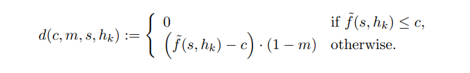
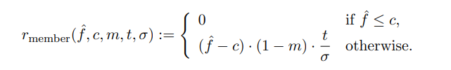
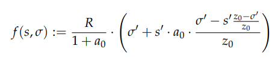

This page aims to explain pool rankings as implemented by the protocol (`cardano-wallet`), i.e. how Daedalus ranks stake pools. This has already been mostly covered in Pal Dorogi's [poool ranking gist](https://gist.github.com/ilap/ad088d31e542f73685a3a245b3ad6c50#cardano-pool-ranking-in-daedalus).
To understand what is going behind the scenes, we have to understand the definitions of some terms we will need:

- **Non-myopic** - defines the long-term viewpoint, which considers all the factors to assess the state of a pool in the long run.
- **Non-myopic pool stake** - the pool's stake in the non-myopic view; this number depends on whether the pool is in the top `k` pools.
- **Non-myopic pool rewards** - the total pool rewards in an epoch for a given pool with it's `non-myopic pool stake`.
- **Non-myopic member rewards** - the amount of rewards the member (delegator) is entitled to in an epoch given a pool's `non-myopic pool rewards`. **This is the final metric used to rank pools in Daedalus.**
- **Hit Rate Estimate** - the protocol's estimation of pool performance. This can range from ~`0.725 - 1`, with unity being the maximum hit rate estimate. The estimate itself is refined after each epoch and if a pool is producing its blocks, the estimate will slowly increase up to unity. The **important thing to note** here is that all pools start with **low hit rate estimates** and only after proving their performance (by producing numerous blocks as they should), they will get a good hit rate estimate.
- **Pool Desirability** - this metric is dependant on the pool parameters (cost, margin and pledge) in combination with the `hit rate estimate`. It evaluates how desirable a pool is for a delegator to maximise his/hers rewards. **The pool desirability formula assumes every pool is saturated - this is to ensure every pool is ranked equally regardless of its live stake.**

### Daedalus Ranking Flowchart {docsify-ignore}

The following flowchart helps to understand how the final ranking in Daedalus is formed.
First, the pools are ordered by their desirability, and the top 150 pools have their non-myopic stake set to saturation (in almost all cases) or their live stake (if thier live stake is greater than saturation).

### Formulas

**Pool Desirability:**

where:

`hk` is the pool's hit rate estimate

`c` is the pool cost

`m` is the pool margin

`s` is the pool pledge

function of pool parameters (pledge, cost, margin) and the `hit rate estimate`. If the calculated rewards (assuming pool saturation) are less than the pool costs, the `desirability` is set to 0.

**Non-myopic member rewards:**

where:

`t` is the intended stake (the slider in Daedalus)

`c` is the pool cost

`m` is the pool margin

`f` is the amount of pool rewards for the epoch

If the calculated nm member rewards are less than the pool costs, the member (delegator) rewards are set to 0 and the pool is currently grayed out in Daedalus.

**General Rewards Formula (f):**

where:

`R` is total rewards available for the epoch

`s'` is the ratio of pool pledge relative to the total supply of ADA

`sigma'` is the ratio of pool stake relative to the total supply of ADA

`z0` is the saturation point

`a0` is the pledge parameter
